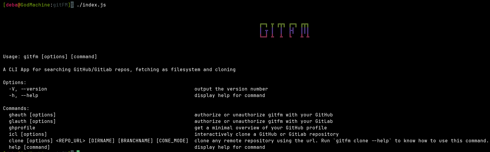
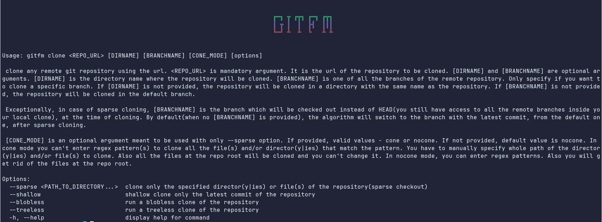

# gitFM 🚀

[](https://www.npmjs.com/package/gitfm)
[](https://opensource.org/licenses/ISC)
[](https://www.typescriptlang.org/)
[](https://nodejs.org/)

> **gitFM** is a modern, developer-first command-line utility for discovering, exploring, and cloning GitHub and GitLab repositories directly from your terminal. Whether you want to quickly clone a single subfolder of a massive monorepo or browse repos interactively without ever leaving your shell, gitFM has you covered.

---

## ✨ Features

- ⚡ **Advanced Partial Cloning**: Clone massive repositories without downloading gigabytes of history or files. Supports **Shallow**, **Blobless**, **Treeless**, and **Sparse-checkout** cloning out of the box.
- 📂 **Interactive Monorepo Navigation**: Search remote repositories and browse remote directory trees interactively to pick exactly which folder to clone.
- 🔐 **Headless GitHub OAuth Device Flow**: Seamless browser passcode login without dealing with client secrets or copy-pasting tokens, plus personal access token (PAT) fallback.
- 🦊 **First-Class GitLab Integration**: Authenticate, verify token validity, rotate personal access tokens with custom expiration dates, and revoke tokens in one command.
- 📊 **Rich Terminal Search (`ghs`)**: Tabular search of public, private, or starred repositories by user, language, topic, or README contents.
- 🛡️ **Sanitization & Safety**: Strict URL validation, directory traversal prevention, ref validation, and safe process execution to protect against command injection.
- 🎨 **Delightful CLI UX**: Rich colors, interactive autocomplete prompts, and dynamic ASCII headers powered by `chalk`, `cfonts`, and `@inquirer`.

---

## 📦 Installation

Ensure you have **Node.js (>= 20)** and **Git** installed on your system.

### Global Installation

```bash
npm install -g gitfm
```

### Instant Execution with npx

You can run commands without installing globally:

```bash
npx gitfm clone <REPO_URL> [options]
```

---

## 🚀 Quick Start & Visuals

To display the main help menu and view all available commands:

```bash
gitfm --help
```



To get detailed instructions and options for any individual command:

```bash
gitfm help <command-name>
# Example:
gitfm help clone
```



> [!NOTE]
> In command help specifications, arguments wrapped in `<>` are **mandatory**, while arguments wrapped in `[]` are **optional**.

---

## 🛠️ Command Reference

### 1. `gitfm clone` — Clone Any Remote Repository

Clone remote Git repositories using normal or partial cloning strategies. No authentication is required for public repositories.

```bash
gitfm clone <REPO_URL> [DIRNAME] [BRANCHNAME] [CONE_MODE] [options]
```

#### Arguments:
- `<REPO_URL>`: *(Mandatory)* The URL of the remote Git repository (`https://`, `ssh://`, or `git@`).
- `[DIRNAME]`: Target directory name. If omitted, defaults to the repository name.
- `[BRANCHNAME]`: Remote branch to checkout.
- `[CONE_MODE]`: `cone` or `nocone` (default: `nocone`). Used with sparse checkout.

#### Options:
| Flag | Description |
| :--- | :--- |
| `--sparse <PATHS...>` | Clone only the specified director(y\|ies) or file(s) (sparse checkout). |
| `--shallow` | Shallow clone only the latest commit (`--depth 1`). |
| `--blobless` | Blobless clone (`--filter=blob:none`) — downloads commits and trees, fetches file contents on demand. |
| `--treeless` | Treeless clone (`--filter=tree:0`) — fetches tree objects and blobs only when needed. |

#### Examples:
```bash
# Normal clone
gitfm clone https://github.com/facebook/react.git

# Shallow clone of latest commit
gitfm clone https://github.com/torvalds/linux.git linux-shallow --shallow

# Blobless clone (optimal for large repos with heavy commit history)
gitfm clone https://github.com/microsoft/vscode.git vscode-blobless --blobless

# Sparse clone of a specific directory in a monorepo
gitfm clone https://github.com/vercel/next.js.git nextjs-examples --sparse examples
```

> [!TIP]
> Read the [GitHub blog guide on partial and shallow clones](https://github.blog/open-source/git/get-up-to-speed-with-partial-clone-and-shallow-clone/) to learn when to use blobless vs. treeless vs. shallow cloning.

---

### 2. `gitfm icl` — Interactive Clone

Interactively search repositories, explore directory trees, and choose cloning preferences on the fly.

```bash
gitfm icl [options]
```

#### Options:
| Flag | Description |
| :--- | :--- |
| `--gh` | Interactively search and clone a **GitHub** repository (authenticated with partial cloning support). |
| `--gl` | Interactively search and clone a **GitLab** project. |
| `-u, --unauthenticated` | Legacy GitHub interactive search and clone (does not require authentication). |

#### Workflow:
1. Enter your search query.
2. Select a repository from the autocomplete list.
3. Review repository metadata (name, description, URL).
4. Choose clone format: **Normal** or **Partial** (`shallow`, `blobless`, `treeless`, or `sparse`).
5. In **Sparse** mode, navigate folders interactively to select exactly what you want to pull down.

---

### 3. `gitfm gh` — GitHub Authentication & Profile

Manage GitHub authorization and check your user overview.

```bash
gitfm gh [options]
```

#### Options:
| Flag | Description |
| :--- | :--- |
| `--auth [TYPE]` | Authorize gitFM with GitHub. Arguments: `web` (OAuth Device Flow) or `token` (PAT). Prompts interactively if omitted. |
| `--profile` | Display a terminal summary card of your authenticated profile. |

#### Authentication Flow:
- **Web Login (OAuth Device Flow)**: Displays your one-time user code, automatically opens your browser window for verification, and listens for authorization approval. Read the author's article on [integrating GitHub Device Flow in CLI apps](https://dev.to/ddebajyati/integrate-github-login-with-oauth-device-flow-in-your-js-cli-28fk) to understand how this works securely without client secrets.
- **Token Login (PAT)**: Authenticate with a personal access token requiring `repo` and `user` scopes.
- Tokens are safely encoded and stored locally in `~/.gitfmrc.json`.

---

### 4. `gitfm gl` — GitLab Authentication & Token Management

Authenticate and manage tokens for GitLab.

```bash
gitfm gl [options]
```

#### Options:
| Flag | Description |
| :--- | :--- |
| `--login` | Log in with a GitLab Personal Access Token (requires `api` scope). |
| `--logout` | Revoke the active token on GitLab and clear stored credentials. |
| `--rotate <EXPIRY_DATE>` | Rotate the active personal access token with a new expiration date (`YYYY-MM-DD`). |

#### Examples:
```bash
# Log in to GitLab
gitfm gl --login

# Rotate current token with a new expiration date
gitfm gl --rotate 2026-12-31

# Logout and revoke token
gitfm gl --logout
```

---

### 5. `gitfm ghs` — GitHub Repository Search

Search GitHub repositories with rich filters and formatted table outputs.

```bash
gitfm ghs [TERM] [options]
```

#### Options:
| Flag | Description |
| :--- | :--- |
| `--me` | Show only repositories owned by the authenticated user. |
| `-p, --private` | Show only private repositories owned by the authenticated user. |
| `-s, --starred` | Show repositories starred by the authenticated user. |
| `-u, --user <USER>` | Show repositories owned by the specified username. |
| `-l, --language <LANG>` | Show repositories matching `TERM` written in the given language. |
| `-t, --topic` | Show repositories matching `TERM` in topic tags. |
| `-r, --readme` | Show repositories matching `TERM` within README files. |

#### Examples:
```bash
# Search repositories by keyword
gitfm ghs cli-utility

# List your own repositories
gitfm ghs --me

# Search TypeScript repositories matching "compiler"
gitfm ghs compiler -l typescript

# Search by topic
gitfm ghs devops --topic

# List your starred repositories
gitfm ghs --starred
```

---

## 🔒 Security & Credentials

- **GitHub OAuth Device Flow**: gitFM never handles client secrets. Authentication uses the OAuth 2.0 Device Authorization Grant ([RFC 8628](https://datatracker.ietf.org/doc/html/rfc8628)), keeping your GitHub credentials secure.
- **Local Dotfiles**: Credentials are encrypted/encoded and stored in user home directory dotfiles (`~/.gitfmrc.json` and `~/.gl.gitfmrc.json`).
- **Input Sanitization**: All user inputs (URLs, file paths, directory targets, branch names, and dates) are rigorously validated to prevent shell injection, path traversal, or command abuse.
- **Safe Subprocesses**: System commands are executed via safe argument arrays (`execFile`) rather than unsanitized shell execution.

---

## 🏗️ Architecture & Development

gitFM is written in TypeScript and follows the **Result Object Pattern** for robust, contextual error handling without unexpected runtime crashes.

### Scripts

```bash
# Build the TypeScript project to dist/
npm run build

# Run ESLint (using Flat Config + typescript-eslint + unicorn rules)
npm run lint
```

### Directory Structure

```
gitFM/
├── assets/img/               # Help screenshots and images
├── src/
│   ├── cloning.ts            # Git execution (normal, shallow, blobless, treeless, sparse)
│   ├── constants.ts          # Cloning options definitions
│   ├── index.ts              # Commander CLI command registration and dispatch
│   ├── pattern.ts            # Result<T, E> functional error handling pattern
│   ├── sanitize.ts           # Input validation and security sanitizers
│   ├── token-storage.ts      # DRY token reading, saving, and management
│   ├── ui.ts                 # Terminal UI, banners, search prompts, and table formatters
│   ├── gh/                   # GitHub integration
│   │   ├── api.ts            # Octokit REST queries & rate limit checks
│   │   ├── auth.ts           # Device Flow OAuth & PAT verification
│   │   ├── config.ts         # GitHub Client ID and scope configs
│   │   └── interactive-clone.ts # GitHub interactive clone workflows
│   └── gl/                   # GitLab integration
│       ├── api.ts            # GitLab v4 API requests, token rotation, and tree navigation
│       ├── config.ts         # GitLab API configs
│       └── interactive-clone.ts # GitLab interactive clone workflows
├── eslint.config.ts          # ESLint flat config with unicorn kebab-case rules
├── tsconfig.json             # TypeScript ES2022 / NodeNext compiler configuration
└── package.json
```

---

## 💬 Feedback & Issues

Have an issue, feature request, or suggestion? Please open an issue in the [GitHub Repository](https://github.com/Debajyati/gitFM/issues).

## ⭐ Star This Repo

If you find gitFM helpful, consider giving it a star on [GitHub](https://github.com/Debajyati/gitFM). It helps more developers discover the project!

---

## 📄 License

This project is licensed under the [ISC License](https://opensource.org/licenses/ISC).
