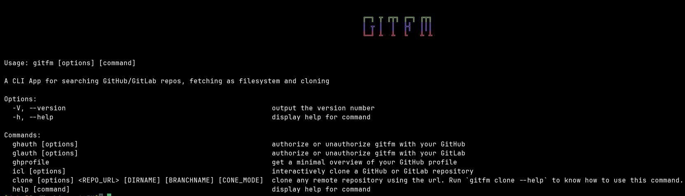

# gitFM

gitFM is a command-line tool that can search GitHub/GitLab repositories, retrieve repository file contents and clone them normally or partially depending on your choice directly from the terminal(never leave the terminal). Your best friend for fetching repository as filesystem and easy cloning.

## Installation

First, make sure you have Node.js and git pre-installed in your system. Then install gitFM globally by running the following command:

```bash
npm install -g gitfm
```

## Usage

### Helptexts

Run `gitfm --help` or `gitfm -h` or `gitfm help` to know get the helptext. It will look like this -


To get more info about any individual command of gitfm, run - `gitfm help <command-name>`. For example, - if you want to know about the `clone` command in detail, you would run - `gitfm help clone`.


> [!NOTE]
> In the helptexts, - an argument enclosed within `[]` signify that the arg is optional and within `<>` signify that the arg is mandatory.

### Descriptions of the Individual Commands

- **`gitfm clone [options]`** :- This command has four options, - `--blobless`, `--treeless`, `--shallow` and `--sparse`. When none of them are provided, it proceeds to perform a normal(cloning the whole repository as usual) git clone of the provided repository URL. This command doesn't require any authentication. This is going to be your most helpful/used command of this application (most likely). `--shallow` option should be used when you want to clone only the latest commit of the repository. `--blobless` and `--treeless` options should be used when you want to clone a repository in a [blobless or treeless format](https://github.blog/open-source/git/get-up-to-speed-with-partial-clone-and-shallow-clone/#). The `--sparse` option should be used when you want to clone only the specified files or directories of the repository. The beauty of this command is that you can run it without installing the CLI (`npx gitfm clone <repourl> [options]`). For more info about the options, run `gitfm clone --help` or `gitfm help clone`.
- **`gitfm ghauth [options]`** :- This command has three options, - `--login`, `--logout` and `--refresh`. When none of them are provided, it will first check if you are already authenticated with GitHub. If you are, it will say so and exit. If you are not, it will ask you to login with your GitHub account(basically, the same as `gitfm ghauth --login`). If you want to logout, run `gitfm ghauth --logout`. If you want to refresh your token, run `gitfm ghauth --refresh`. In case of browser login, a browser window/tab will be automatically opened with the verification URL if and only if your default browser is anything between **chrome**, **edge** or **firefox**. If your default browser is something else, the verification URL will be shown in the console so that you can manually open it in the browser to log in. After a successful login, the token is stored in the `$HOME` directory of your system in a config file named `.gitfmrc.json`. Your token is revoked by gitfm while logging out only if it is an ***oauth token** (you authenticated using Browser with passcodes). If it is a **PAT**, gitfm will just reset the config file. **TOKEN WON'T BE DELETED**. To delete your token, you should directly do that from your GitHub developer settings. For more info about the options, run `gitfm ghauth --help` or `gitfm help ghauth`.
-  **`gitfm ghprofile`** :- Shows a minimal view of your GitHub profile. This command takes no arguments. Requires you to be authenticated. If not, it will autostart interactive authentication mode. When authentication process will complete, it will show your profile info.
-   **`gitfm glauth [options]`** :- This command also contains 3 options - `--login`, `--logout`, `--rotate`. You can authenticate gitfm with your Gitlab account only using a personal access token. Browser login is not supported and won't be implemented in future. The token is stored in a JSON file(`.gl.gitfmrc.json`) inside the `$HOME` directory of your system. For more info, run - `gitfm glauth -h` or `gitfm help glauth`.
-   **`gitfm icl [options]`** :- 

## Feedback

If you encounter any problems or have any suggestions when using gitFM, you are welcome to submit an issue in the [GitHub repository](https://github.com/Debajyati/gitFM).

## Star 🌟 This repo
Show some love to this project by starring it. It will help in increasing the visibility of this project and also in motivating me to work on this project more often.
